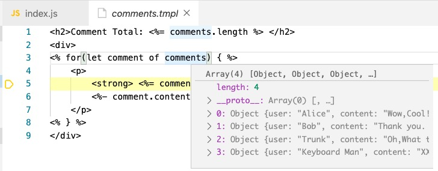

# Light-Template

A Template Engine for JavaScript.

[](https://opensource.org/licenses/MIT)
<a href="https://travis-ci.com/light0x00/light-template"></a> 
<a href="https://www.npmjs.com/package/light-template"></a>

## Features

- Using original JS syntax to control how to render your template.
- Supporting sub-template reference
- Supporting debugging directly on template .



## Install

**npm**

```bash
npm install light-template
```

**browser**

```html
<script src="path/to/light-template.min.js"></script>
<script>
	let { default: template } = LIGHT_TEMPLATE
</script>
```

## Getting started

```ts
import template from "light-template";

//write down your template here
let tmpl =`<p><%- data.name %><p>
<p><%= data.desc %></p>
<ul><% for(let tag of data.tags){ %>
<li><% print(tag) %></li><% } %>
</ul>`
//write down your data object here
let data = {
	name: "<<Alice&Bob>>",
	desc: "How do Alice and Bob prevent Truck",
	tags: [
		"HASH",
		"MAC",
		"RSA",
		"Digital Signature",
		"CA"
	]
}
//compile the template
let executor = template(tmpl, { variable: "data", soureMap: true }) 
//use the data to render the template
let result = executor.render(data)

console.log(result)
```

Output:

```html
<p>&lt;&lt;Alice&amp;Bob&gt;&gt;<p>
<p>How do Alice and Bob prevent Truck</p>
<ul>
<li>HASH</li>
<li>MAC</li>
<li>RSA</li>
<li>Digital Signature</li>
<li>CA</li>
</ul>
```

To get a more complex example to reference ➡️ [示例](https://github.com/light0x00/light-template/tree/master/examples)

## Syntax

The syntax is mainly as same as [lodash.template](https://lodash.com/docs/4.17.15#template) , the only difference is that there is a new infstruction called 'sub-template link'.

**Interpolation**

`<%=`,顾名思义,就是插入一个值

```ts
let tmpl =`<p><%= data.greeting %><p>`
let data = { greeting: "Hello World" }

let exe = template(tmpl, { variable: "data" })
let result = exe.render(data)

console.log(result)
// output:
// <p>Hello World<p>
```

**HTML Escape**

`<%-` 可用于转义HTML保留字符

```ts
let tmpl =`<p><%- data.greeting %><p>`
let data = { greeting: `` }

let exe = template(tmpl, { variable: "data" })
let result = exe.render(data)

console.log(result)
// output:
// <p>&lt;img src=&quot;xss&quot;&gt;<p>
```

**Script**

Between `<%` and `%>` , you can write any JavaScript Code. What's more, it offers a built-in function `print` to output the JS object to the final rendering result.

```ts
let tmpl =`<ul>
<% 
for(let user of users){
	print('<li>'+user+'</li>')
} 
%>
</ul>`
let data = ["Alice","Bob"]

let result = template(tmpl, { variable: "users", soureMap: true }).render(data)

console.log(result)
// output:
// <ul>
// <li>Alice</li><li>Bob</li>
// </ul>
```

**Link Sub-Template**

Between `<%@` and `%>`, you can specify the template name which you want to link.  The other side, you can pass `sourceLoader` to find the template using the name you specified in template. 

whenever `light-template` encountered a sub-template link instruction, it pass the template name to `sourceLoader` that you offered and get the return value as the target sub-template to compile. 
Note the template name is not required being a path name, you can specify its form as your whish, just make sure it can be found by `sourceLoader` you passed.

```ts
let tmpls = new Map()
tmpls.set("greeting.tmpl", `Hello,<%= user.name %>`)

// Specify template sourceLoader
let sourceLoader = (sourceName) => {
	if (!tmpls.has(sourceName))
		throw new Error("Can't find template named " + sourceName)
	return tmpls.get(sourceName)
}

// entry template
// Use `<%@ @>` to specify the template name which you want to link.
let entry = `<p><%@ greeting.tmpl %></p>`

// pass the entry template and the options object with sourceLoader.
let exe = template(entry, { variable: "user", sourceLoader, soureMap: true })

// pass the data object to render final template
let result = exe.render({ name: "Alice" })

console.log(result)

// output:
// <p>Hello,Alice</p>
```

**Reserved words Escape**

`<%` and `%>` are reserved words. Use `\` to escape it if you want to put it as a raw text on your template.

```ts
let tmpl ="Using the reserved words as raw worlds: \\<% code \\%>"
let result = template(tmpl, { variable: "data", soureMap: true }).render({})

console.log(result)
// output:
//Using the reserved words as raw worlds: <% code %>
```

## Principle

It compiles a template to a JS function, and the function has a parameter receiving a data object, that will decide the final rendering result. 

```html
<p><%= data.greeting %><p>
```

⬇️

```js
function(data){
	let __p = ""
	__p+="<p>"+ data.greeting +"<p>"
	return __p
}
```

## API

**template()**

```ts
template(tmpl: string, options?: TemplateSettings): TemplateExecutor
```

- tmpl ,specify the template content
- TemplateSettings
	- `variable?: string`, specify the variable name of your data object, you can use it to access your data object.
	- `soureMap?: boolean`,whether generate a sourceMap,if you want to debug you can set `true`.
	- `sourceName? : string` ,specify the entry template name, if you used 「sub-template link」, you can use set a name for entry template, it's helpful to differentiate different template when you are debuging.
	- `sourceLoader? : (soureName :string)=>string`, A function used to resolve the sub-template,receving a template name, returning the template content.if you used the feature「sub-template link」,it‘s required.
- TemplateExecutor
	- `render(data :any)`, receve a data object to render the template.
	- `source: string`,A segment of JavaScript code generated from the template you pass.

**compile()**

```ts
compile(tmpl: string, settings?: TemplateSettings): string
```
The Only one difference with `template()` is that it only returns the JavaScript code generated from the template you pass.
